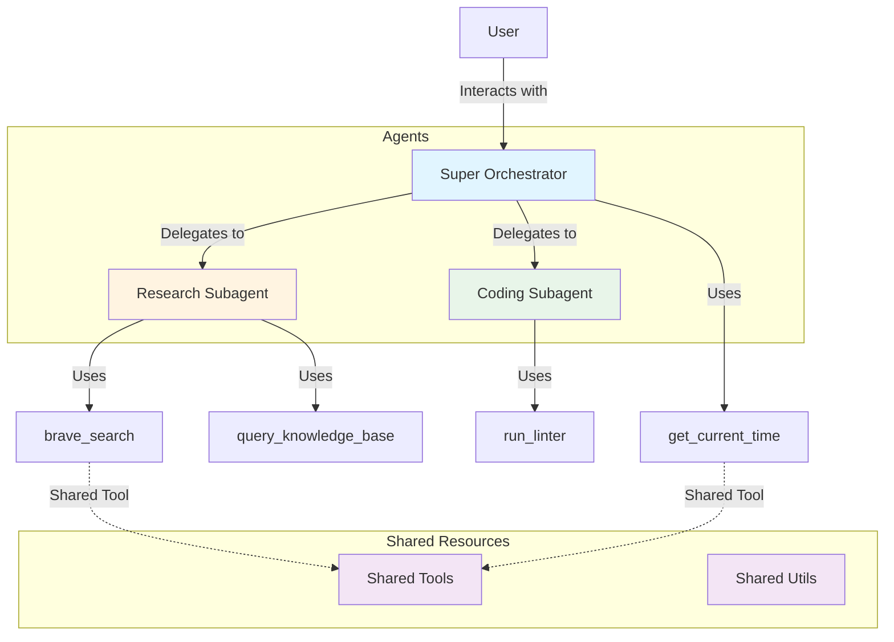

# ADK Multi-Agent Sample Project

A production-ready sample project demonstrating best practices for building multi-agent systems using the Google Agent Development Kit (ADK).

## Architecture Overview



## Project Structure

```text
adk-multi-agent-sample/
├── agents/                    # Agent definitions and implementations
│   ├── coding_subagent/      # Code analysis and linting agent
│   ├── research_subagent/    # Information gathering and research agent
│   └── super_orchestrator/   # Top-level orchestrator that delegates to sub-agents
├── shared/                    # Shared resources across agents
│   ├── tools/                # Common tools used by multiple agents
│   └── utils/                # Shared utilities and configurations
├── tests/                     # Test suite
│   ├── unit/                 # Unit tests for individual tools and functions
│   └── integration/          # Integration tests for agent configurations
├── env.example               # Environment variable template
├── pyproject.toml            # Python project dependencies and metadata
├── README.md                 # Project documentation
└── uv.lock                   # Locked dependency versions
```

## Key Components

### Agents

1. **Super Orchestrator** (`agents/super_orchestrator/agent.py`)
   - Top-level agent that receives user requests
   - Delegates tasks to specialized sub-agents
   - Has 2 sub-agents and 1 shared tool
   - Model: `gemini-2.5-flash`

2. **Research Subagent** (`agents/research_subagent/agent.py`)
   - Specialized in information gathering and research
   - Tools: `brave_search` (shared), `query_knowledge_base` (local)
   - Model: `gemini-2.5-flash`

3. **Coding Subagent** (`agents/coding_subagent/agent.py`)
   - Specialized in code analysis and linting
   - Tools: `run_linter` (local)
   - Model: `gemini-2.5-flash`

### Shared Tools

Located in `shared/tools/common_tools.py`:

- **`brave_search(query: str)`** - Web search functionality
- **`get_current_time()`** - Returns current server time

These tools are imported and shared across multiple agents as the same object instances, promoting code reuse.

### Shared Utilities

Located in `shared/utils/config.py`:

- **`get_llm_config()`** - Returns common LLM configuration settings

## Installation & Setup

### Prerequisites

- Python 3.13+
- [uv](https://docs.astral.sh/uv/) - Fast Python package installer
- Google ADK CLI (`adk`)
- Google Cloud credentials (for Gemini models)

### Install uv (if not already installed)

```bash
# On macOS and Linux
curl -LsSf https://astral.sh/uv/install.sh | sh

# On Windows
powershell -c "irm https://astral.sh/uv/install.ps1 | iex"

# Or with pip
pip install uv
```

### Install Dependencies

```bash
# Sync all dependencies (recommended)
uv sync

# This will:
# - Create a virtual environment (.venv)
# - Install all dependencies from pyproject.toml
# - Use the locked versions from uv.lock
```

Activate the virtual environment:

```bash
# On macOS and Linux
source .venv/bin/activate

# On Windows
.venv\Scripts\activate
```

### Configure Environment

```bash
# Copy the example environment file
cp env.example .env

# Edit .env with your credentials
# MODEL_NAME=gemini-1.5-pro-002
# GOOGLE_API_KEY=your_api_key_here
```

## Running Agents

### Run Individual Agents

From the project root directory:

```bash
# Run the research subagent
adk run agents/research_subagent

# Run the coding subagent
adk run agents/coding_subagent

# Run the super orchestrator (with sub-agents)
adk run agents/super_orchestrator
```

### Run with Web UI

Launch all agents with a web interface:

```bash
# Start the web server (accessible at http://127.0.0.1:8000)
adk web agents

# Or specify a custom port
adk web agents --port 8080
```

## Testing

### Running All Tests

Run the entire test suite from the project root:

```bash
python3 -m unittest discover tests -v
```

Expected output:
```
test_agent_initialization ... ok
test_run_linter_fail ... ok
test_run_linter_pass ... ok
test_query_knowledge_base ... ok
test_brave_search ... ok
test_get_current_time ... ok
----------------------------------------------------------------------
Ran 6 tests in 0.001s

OK
```

### Running Unit Tests

Unit tests verify individual tool functions in isolation.

```bash
# Run all unit tests
python3 -m unittest discover tests/unit -v

# Run specific test file
python3 -m unittest tests.unit.shared.test_common_tools -v
python3 -m unittest tests.unit.agents.research_subagent.test_tools -v
python3 -m unittest tests.unit.agents.coding_subagent.test_tools -v
```

**What Unit Tests Cover:**

- ✅ Shared tools (`brave_search`, `get_current_time`)
- ✅ Research-specific tools (`query_knowledge_base`)
- ✅ Coding-specific tools (`run_linter`)
- ✅ Tool return values and behavior
- ✅ Error handling (e.g., linter with no imports)

**Example Unit Test:**

```python
def test_brave_search(self):
    result = brave_search("test query")
    self.assertIn("[Mock Search Result]", result)
    self.assertIn("test query", result)
```

### Running Integration Tests

Integration tests verify agent configuration and structure.

```bash
# Run all integration tests
python3 -m unittest discover tests/integration -v

# Run specific integration test
python3 -m unittest tests.integration.test_research_agent -v
```

**What Integration Tests Cover:**

- ✅ Agent initialization and configuration
- ✅ Correct tools attached to agents
- ✅ Agent name and metadata
- ✅ Tool availability and structure

**Example Integration Test:**

```python
def test_agent_initialization(self):
    self.assertEqual(research_agent.name, "research_subagent")
    self.assertEqual(len(research_agent.tools), 2)
    tool_names = [t.__name__ for t in research_agent.tools]
    self.assertIn("brave_search", tool_names)
```

### Writing New Tests

#### Adding a Unit Test for a New Tool

1. Create the tool in the appropriate location:
   - Shared tools: `shared/tools/common_tools.py`
   - Agent-specific: `agents/<agent_name>/tools.py`

2. Create corresponding test file:
   ```python
   # tests/unit/shared/test_new_tool.py
   import unittest
   from shared.tools.common_tools import my_new_tool


   class TestNewTool(unittest.TestCase):
       def test_basic_functionality(self):
           result = my_new_tool("input")
           self.assertEqual(result, "expected_output")
   ```

3. Run the test:
   ```bash
   python3 -m unittest tests.unit.shared.test_new_tool -v
   ```

#### Adding an Integration Test for a New Agent

1. Create test file:
   ```python
   # tests/integration/test_my_agent.py
   import unittest
   from unittest.mock import MagicMock
   import sys

   # Mock google.adk for testing
   mock_adk = MagicMock()
   sys.modules["google"] = mock_adk
   sys.modules["google.adk"] = mock_adk.adk
   sys.modules["google.adk.agents"] = mock_adk.adk.agents


   class MockLlmAgent:
       def __init__(self, name, instruction, tools, **kwargs):
           self.name = name
           self.instruction = instruction
           self.tools = tools


   sys.modules["google.adk.agents"].LlmAgent = MockLlmAgent

   from agents.my_agent.agent import my_agent


   class TestMyAgent(unittest.TestCase):
       def test_agent_structure(self):
           self.assertEqual(my_agent.name, "my_agent")
           self.assertEqual(len(my_agent.tools), 3)
   ```

## Development Best Practices

### Import Path Management

Each agent file includes sys.path management to work in multiple contexts:

```python
import sys
from pathlib import Path

# Ensure project root is in sys.path for imports to work in all contexts
# (works for both 'adk run' and regular Python imports)
project_root = Path(__file__).parent.parent.parent
if str(project_root) not in sys.path:
    sys.path.insert(0, str(project_root))
```

This enables:
- ✅ Direct Python imports: `from agents.X.agent import ...`
- ✅ ADK CLI commands: `adk run agents/X`
- ✅ ADK web interface: `adk web agents`

### Shared vs Local Tools

**Use Shared Tools When:**
- Multiple agents need the same functionality
- The tool provides generic utility (search, time, etc.)
- You want to maintain a single implementation

**Use Local Tools When:**
- The tool is specific to one agent's domain
- The tool has agent-specific logic
- You want to keep agent code self-contained

### Agent Configuration

Each agent should define:
- `name`: Unique identifier for the agent
- `model`: The LLM model to use
- `instruction`: System prompt describing the agent's role
- `tools`: List of available tools
- `sub_agents`: (Optional) For orchestrator agents
- `root_agent`: Export for `adk run` to discover

## Troubleshooting

### Import Errors

**Error:** `ModuleNotFoundError: No module named 'shared'`

**Solution:** Ensure you're running from the project root directory, or the sys.path management code is present in your agent file.

### Model Not Found

**Error:** `No model found for agent_name`

**Solution:** Ensure each agent has a `model` parameter specified:
```python
agent = LlmAgent(name="my_agent", model="gemini-2.5-flash", ...)  # Add this line
```

### Tests Failing

**Error:** Tests import errors or failures

**Solution:** Run tests from the project root:
```bash
cd /path/to/adk-sample-agents
python3 -m unittest discover tests -v
```

## Contributing

When adding new features:

1. ✅ Add corresponding tests (unit and/or integration)
2. ✅ Update this README with new functionality
3. ✅ Follow the existing code structure
4. ✅ Ensure all tests pass before committing

## License

This is a sample project for demonstration purposes.

## Resources

- [Google ADK Documentation](https://cloud.google.com/vertex-ai/generative-ai/docs/reasoning-engine)
- [Agent Development Kit GitHub](https://github.com/googleapis/python-genai)
